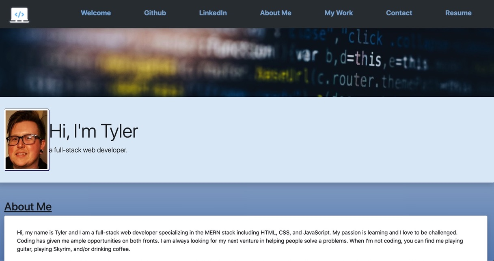

# Portfolio of Tyler Hance - Documentation

<h2>Description</h2>

This project was assigned to have me start building out my main portfolio website from scratch. It will be a platform to show off my abilities and accomplishments to my peers and future employer. 

<h2>Design Decisions</h2>

* I built my portfolio site out with simplicity in mind. I wanted to implement simple, clean lines and complimentary colors that help the viewer navigate with ease and not feel overwhelmed with over-complicated themes and colors. I simplified everything and focused more on structure than over-saturating the page with colors and effects. This gives me a solid foundation to keep adding more complex features in the future.

* I updated my portfolio with the newest project, Gift List. I also included a link with my resume and refactored the aesthetic look and responsiveness of the webpage.

<h2>Links</h2>

* Check out my portfolio [Here](https://tylerhance.github.io/webdev-portfolio/)

