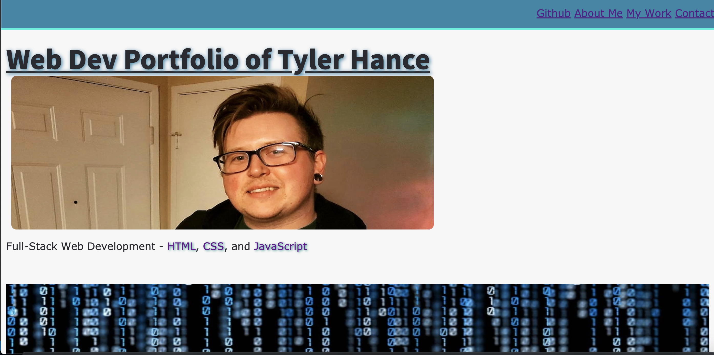

# Portfolio of Tyler Hance - Documentation

<h2>Description</h2>

This project was assigned to have me start building out my main portfolio website from scratch. It will be a platform to show off my abilities and accomplishments to my peers and future employeers. 

<h2>Design Decisions</h2>

* I built the site out with simplicity in mind. I used simple, clean lines and complimentary colors that help the viewer navigate with ease and not feel overwhelmed with over-complicated themes and colors. The design of the page also relates to the kind of person I am. My initial design had background images and gradient color schemes but I realized that this page is also showing who I am as a person. To give the users a better idea of who I am, I simplified everything and focused more on structure than over-saturating the page with colors and effects. This gives me a solid foundation to keep adding more complex features in the future, while giving future clients/employeers a glimpse of who I am as a layed back, easy-going person.

<h2>Links</h2>

* 

